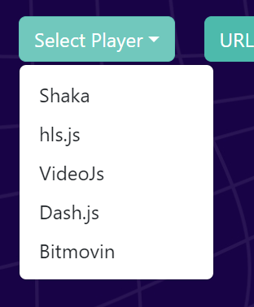
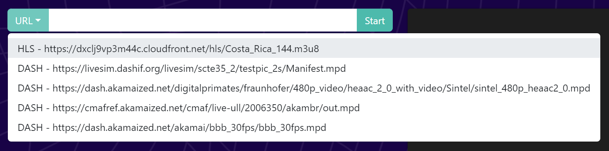
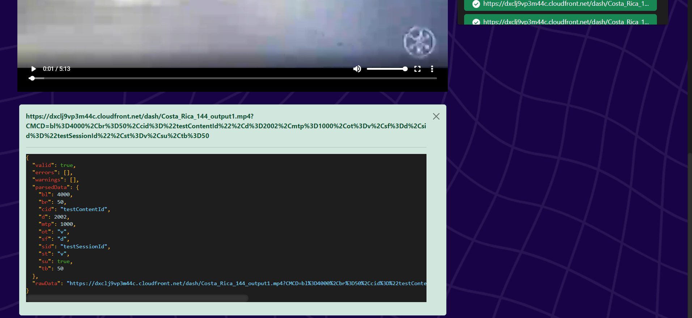

<h3 align="left">
	<b>
	  <a  href="https://montevideotech.dev/summer-camp-2023/"></a><br>
  </b>
</h3>

# cmcd-react-test-app

##  Table  of  contents

- [cmcd-react-test-app](#cmcd-react-test-app)
	- [Table  of  contents](#table--of--contents)
	- [Overview](#overview)
	- [Usage](#usage)
	- [Setup](#setup)
		- [Before start](#before-start)
		- [Run local](#run-local)
	- [Troubleshooting](#troubleshooting)
  
## Overview

This React app is designed to validate CMCD (Common Media Client Data) requests from different players. It provides a user-friendly interface to enter a manifest URL and view the requests made by the player, along with their validation status.


## Usage
To validate CMCD requests using this app, follow these steps:

1. Select a player.
   


2. To initiate playback, there are two options:

- Enter the manifest URL: If you have a specific URL in mind, simply type or paste it into the designated field.


- Choose from the dropdown: Alternatively, select a pre-defined URL from the provided dropdown menu.



Once you've entered the manifest URL or made a selection from the dropdown, click the "Start" button to begin playback.

> **_NOTE:_** The requests made by the player will be displayed in the panel on the right-hand side. The color of the request indicates its validation status: green for valid, red for invalid, and yellow for warnings.

3. To view the validation output of a request, click on it and scroll down.
   



## Setup 

### Before start

Make sure to run the install and build of npm before run the local server:

```console
npm i
npm run build
```

### Run local


```console
npm run dev
```
The web will be available on: localhost:5173

## Troubleshooting
If you encounter any issues with the CMCD Request Validator, you can try the following troubleshooting steps:

- Ensure that you have entered a valid manifest URL.
- Check the console for any error messages.
- Verify that you have the necessary dependencies installed.
